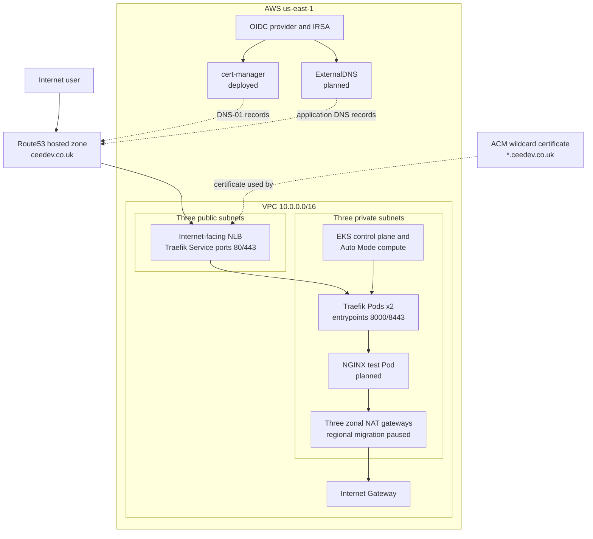

# Architecture

## Traffic and control flow

1. A user requests an application hostname such as `nginx.ceedev.co.uk`.
2. Route53 resolves the hostname to the NLB created for the Traefik Service.
3. The NLB forwards traffic to a healthy Traefik Pod in a private subnet.
4. Traefik matches the request against an IngressRoute and forwards it to the
   Kubernetes Service for the application.
5. The Service selects application Pods by label and forwards traffic to one
   of their Pod IPs.

The NGINX application path is planned but not deployed at the time this
document was written. The currently reachable platform component is Traefik.
