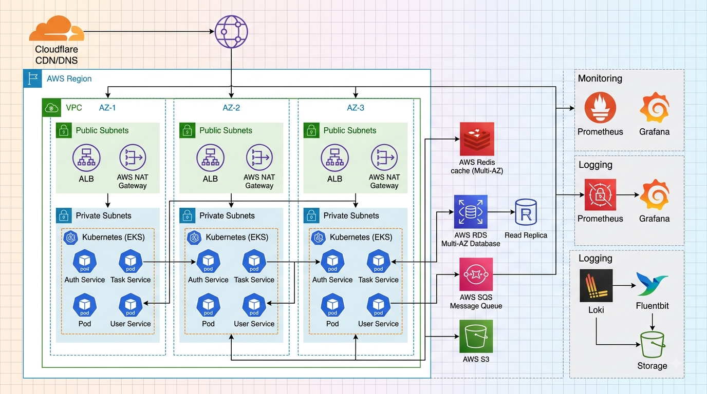
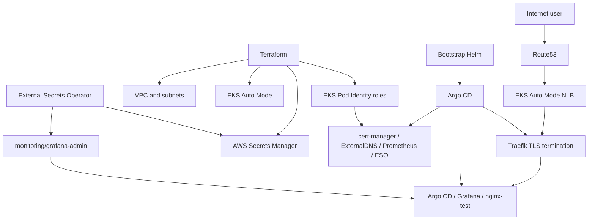

# Architecture

## EKS system design

Terraform finishes AWS provisioning before Helm configures kubectl. The
bootstrap Argo CD release then reads the `EKS/gitops/applications` tree and
reconciles each child Application in sync-wave order.
